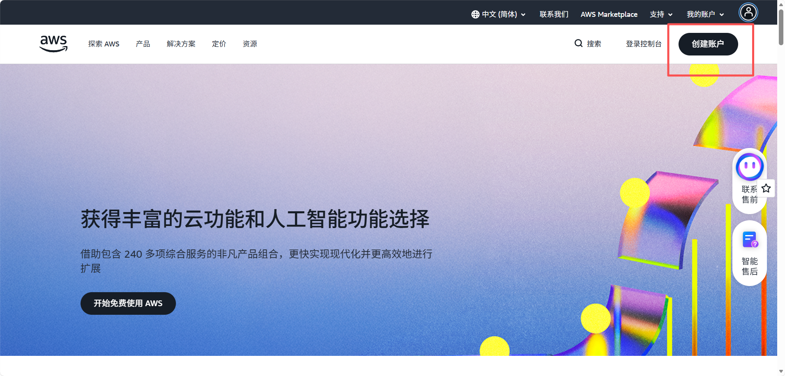

# 免费或者尽可能少的钱去搭建自己的clawdbot（附带一个私人的VPN）
经过这几天的资料查询和研究📚，把网上各种搭建专属 clawdbot 的方法好好总结了一番✅，核心要点归纳如下：
clawdbot 分本地部署和线上部署两种方式💻，本地部署对 GPU 配置有硬性要求⚡，身为轻薄本用户的我，果断劝退❌。这里主讲线上（声明：本人搭配为 美国服务器+纸飞机）。
# 一、首先需要一个服务器（vps）
国内的服务器和国外的服务器我都试过了，国内服务器我是失败了，具体应该是代理原因，因为我是用的大模型是智谱的glm 4.7，然后机器人api是纸飞机的，然后服务器还是国内的，这可能就导致服务器无法访问我的机器人（当然你们也可以试试其他的搭配，比如Whatsapp）。个人建议还是用国外的。
# VPS的获取方式（注意：服务器的内存最好大于等于2GB）：
# 国内：
1.（这怎么不算一种免费的方式嘞，嘻嘻）例如
阿里云（https://www.aliyun.com）
天翼云（https://www.ctyun.cn/）
新用户都有送的，阿里云好像送一年，天翼云现在送7天，有需要可以拿来练练手。
2.（一种比较划算的而且方便的懒人方式）腾讯云有个10分钟部署的方案，大家网上搜关键字就可以找到了，这边不提供网站了，具体的我也没去了解，不过vps的ip应该属于海外，姑且给他先放在国内的方式上吧。
# 国外：
1.（先说免费的）想必和多人也知道就是就是注册aws免费送。
首先，打开亚马逊云服务器官网，完成账号注册 / 登录（aws.amazon.com）

2.进去控制台应该能看到EC2云服务器→启动实例  
3.建议选择Ubuntu版本（因为自己用的多）  
4.自己挑选免费套餐的实例  
5.实例启动后点击连接→确认连接  
6.随后会弹出黑色的终端操作窗口
