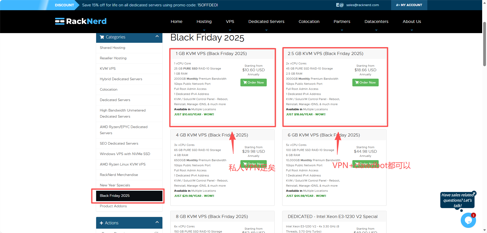
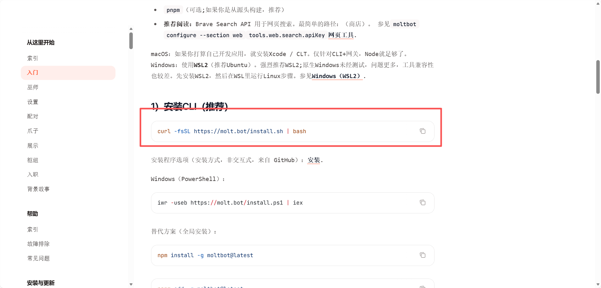
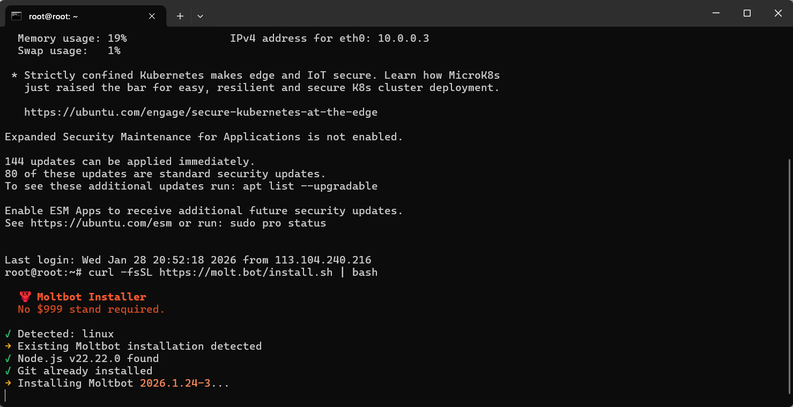

# 免费或低成本搭建个人clawdbot（附带私人VPN）

经过这几天的资料查询和研究📚，把网上各种搭建专属 clawdbot 的方法好好总结了一番✅，核心要点归纳如下👇：

clawdbot 分本地部署和线上部署两种方式💻，本地部署对 GPU 配置有硬性要求⚡，身为轻薄本用户的我，果断劝退❌！这里主讲线上部署（声明：本人搭配为 🇺🇸美国服务器+📱纸飞机）。

# 一、首先需要一个服务器（vps）🖥️

国内的服务器和国外的服务器我都试过了🔍，国内服务器我是失败了❌，具体应该是代理原因，因为我用的大模型是智谱的glm 4.7，机器人api是纸飞机的，服务器还是国内的，这可能就导致服务器无法访问我的机器人（当然你们也可以试试其他搭配，比如📲Whatsapp）。个人建议优先选国外服务器✅！

# VPS的获取方式（⚠️注意：服务器的内存最好≥2GB）：

# 国内：🇨🇳

1.（这怎么不算一种免费方式嘞，嘻嘻😜）例如：

阿里云（https://www.aliyun.com）

天翼云（https://www.ctyun.cn/）

新用户都有赠送🎁，阿里云好像送一年，天翼云现在送7天，有需要可以拿来练练手👋！

2.（一种比较划算且方便的懒人方式😴）腾讯云有个10分钟部署的方案，大家网上搜关键字就能找到，这边不提供网站啦，具体我也没去了解，不过vps的ip应该属于海外，姑且先放在国内方式里～

国外：🌍

# 第一种(免费的真不好弄，但真的香🤤)

1.（先说免费的🆓）想必很多人也知道，注册aws免费送，送一年还是多久来着（白嫖党嘴角都压不住了😆），我卡在绑银行卡那一步了，无福消受😭（我直接哭死）。

首先，打开亚马逊云服务器官网，完成账号注册 / 登录（aws.amazon.com）🔗

（就贴图一张啦，github还没用明白，好吧我有点懒不想去截图了😝）

2. 进去控制台，应该能看到EC2云服务器→启动实例🚀

3. 建议选择Ubuntu版本（因为自己用得多，顺手💪）

4. 挑选免费套餐的实例🆓

5. 实例启动后，点击连接→确认连接✅

6. 随后会弹出黑色的终端操作窗口💻

# 第二种

1.（按道理也是免费的🆓）但好像要纯净的vpn，这里有教程🔗https://www.ahhhhfs.com/79099/

（好像额度变小了😮‍💨，我的ip不够纯，ping0.cc可以测试vpn的纯度📊）

# 第三种

1. 这就需要自己购买国外的vps了💸，查资料时看到这个meowvps.com/blog很全面，先贴出来给大家参考📖。

2. 我自己在https://www.racknerd.com 上买的，算比较便宜了💰，搭建自己的服务器70多一年，加clawdbot可能就要140左右（可以使用支付宝，很方便✅）。

当然，大家可以自行决定套餐类型，按需选择就好👍！

# 二、接下来就开始部署啦🚀

1. 连接自己的vps，我喜欢用ssh进行连接🔗

不同系统下的 SSH 情况，逐一说明👇：

1. Linux 系统（如 Ubuntu、CentOS、Debian 等）🐧

SSH 是 Linux 系统的标配组件，默认已预装，不需要单独下载✅。

- 你可以直接在终端输入 `ssh` 命令验证：

ssh -V  # 查看 SSH 版本，验证是否安装

- 如果极少数情况未安装（比如极简版系统），只需通过系统包管理器安装即可👇：

# Ubuntu/Debian 系列
sudo apt update && sudo apt install openssh-client
# CentOS/RHEL 系列
sudo yum install openssh-clients

2. macOS 系统🍎

macOS 同样默认内置 SSH 客户端，直接在「终端」里输入 `ssh` 命令即可使用，无需下载✅！

3. Windows 系统🪟

- Windows 10 1809 及以上版本 / Windows 11：微软已内置 OpenSSH 客户端，默认启用（若未启用，可通过「设置 > 应用 > 可选功能 > 添加功能」搜索「OpenSSH 客户端」安装）🔧。

- Windows 7/8/早期 Win10 版本：需要单独下载 SSH 工具，推荐两款常用的👇：

- OpenSSH for Windows（微软官方）：可通过 Chocolatey 包管理器安装 `choco install openssh`；

- PuTTY（第三方常用工具）：官网下载（https://www.putty.org/）🔗，是图形化 SSH 客户端，也包含 `pscp`/`plink` 等命令行工具。

（附一张操作示意图📸）

# 2. 连接成功后，打开官网教程🔗https://docs.molt.bot/start/getting-started

（官网有详细步骤，我这里也同步提供，双重保障✅）

（教程页面示意图📸）

然后在终端先输入命令👇：apt install curl

再复制指令👇：curl -fsSL https://molt.bot/install.sh | bash

之后按步骤填写api、配对bot即可✅（晚点更新图片，第一次弄的时候没截图，抱歉啦😣）

（后续补更的配对示意图📸）

# 三、私人VPN🔒

有了国外vps，一切都好办啦🥳！在github上搜索VPN，第二条就是教程，操作相当方便✅！
